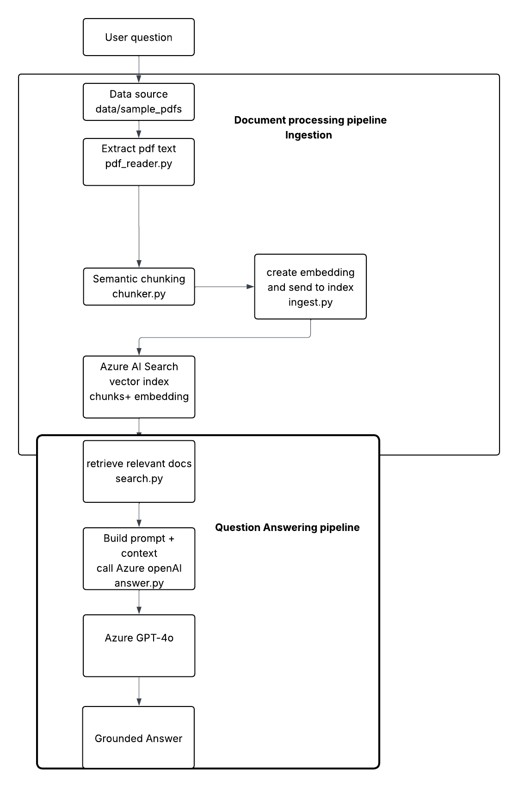

## RAG Research Agent (v1)

A minimal but **production-minded Retrieval-Augmented Generation (RAG) system** built with **Azure OpenAI, Azure AI Search, and Python**.

This version implements the core RAG pipeline:

**document ingestion → embedding generation → vector search → grounded LLM responses with citations**

The goal of this project is to build a **clean, modular AI system** that can evolve into a scalable multi-agent architecture.

---

# Overview

This project is the first stage of a multi-version AI system designed to evolve from a simple RAG pipeline into a modular **agent-oriented architecture**.

The roadmap focuses on **engineering discipline, modular design, and incremental system complexity**.

Version 1 prioritizes:

* Correctness
* Clean architecture
* Reliable retrieval
* Grounded responses


---

# RAG pipeline Architecture Diagram



### Document Processing Pipeline

1. **PDF ingestion**
   - Source documents stored in `data/sample_pdfs`

2. **Text extraction**
   - `pdf_reader.py` extracts raw text from PDFs

3. **Semantic chunking**
   - `chunker.py` splits text into semantically meaningful chunks

4. **Embedding generation**
   - `ingest.py` generates embeddings using Azure OpenAI

5. **Vector indexing**
   - Chunks + embeddings stored in **Azure AI Search**

---

### Question Answering Pipeline

1. **User query**
2. **Vector search retrieval**
   - `search.py` retrieves relevant document chunks
3. **Prompt construction**
   - `answer.py` builds a grounded prompt with retrieved context
4. **LLM generation**
   - Azure **GPT-4o** generates the response
5. **Grounded answer**
   - Response includes context from retrieved documents


---

# Features (v1)

* PDF ingestion and text extraction
* Semantic chunking pipeline
* Embedding generation using Azure OpenAI
* Vector search using Azure AI Search
* Grounded responses generated by GPT-4o
* Source citation tracking
* Modular Python project architecture

---

# Project Structure

```
rag-research-agent/

config/
    settings.py

ingestion/
    ingest.py
    chunker.py
    pdf_reader.py

retrieval/
    search.py

llm/
    answer.py
    openai_client.py

config/
    settings.py

data/
    sample_pdfs/

main.py
requirements.txt
README.md

docs/
    diagrams

tests/
    smoke_test.py
```

---

# Setup

### 1 Create Azure Resources

* Azure OpenAI
* Azure AI Search
* Storage Account 

---

### 2 Configure Environment Variables

Create a `.env` file:

```
AZURE_OPENAI_ENDPOINT=
AZURE_OPENAI_KEY=
AZURE_SEARCH_ENDPOINT=
AZURE_OPENAI_API_VERSION
AZURE_SEARCH_KEY=
AZURE_SEARCH_INDEX=
```

---

### 3 Install Dependencies

```
pip install -r requirements.txt
```

---

# Running the Agent

### Ingest Documents

```
python ingestion/ingest.py --path data/sample_pdfs/
```

### Ask a Question

```
python main.py --question "What does document X say about Y?"
```

The system retrieves relevant chunks from the vector index and generates a grounded response with citations.

---

# Running Tests

Run tests from the project root so imports like `from config.settings import settings` resolve correctly.

```
python -m tests.smoke_test
```

or

```
python -m pytest
```

Avoid running test files directly (for example: `python tests/smoke_test.py`).

---

# Version Roadmap

### v1 — Core RAG Pipeline

Document ingestion, embeddings, vector search, grounded answers

### v2 — API Layer

FastAPI interface, hybrid retrieval, CI pipeline

### v3 — Observability

Logging, evaluation metrics, monitoring, multi-step reasoning

### v4 — Agent Architecture

Modular microservices and multi-agent orchestration

---

# Author

**Niama Ahansal**

Computer Engineering — University of Ottawa
AI Systems & Applied Machine Learning
