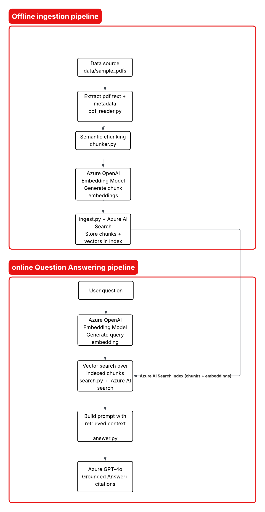

# RAG Research Agent (v1)

A modular Retrieval-Augmented Generation (RAG) system built with Azure OpenAI and Azure AI Search.

This project implements an end-to-end pipeline for ingesting documents, indexing them as embeddings, retrieving relevant context, and generating grounded answers with citations.

---

## Demo Video
[](https://youtu.be/h-ciobBha74)

## Key Features

* End-to-end RAG pipeline (ingestion -> retrieval -> generation)
* Vector-based semantic search using Azure AI Search
* Grounded answer generation with source attribution
* Modular architecture for easy extension into v2/v3
* Smoke tests and unit tests for pipeline validation

---

## System Overview

The system is designed around two main flows:

### 1. Ingestion Pipeline

* Extract text from PDFs
* Clean and normalize content
* Split text into overlapping chunks
* Generate embeddings using Azure OpenAI
* Index chunks into Azure AI Search

### 2. Online QA Pipeline

* Embed user query
* Perform vector similarity search
* Select top-k relevant chunks
* Construct grounded prompt
* Generate answer using LLM
* Return answer with source references

---

## Architecture



---

## Project Structure

```text
rag-search-agent/
   config/
   ingestion/
   retrieval/
   llm/
   services/            # (v2 extension point)
   data/
   docs/
   tests/
   run_ingestion.py
   main.py              # orchestrator (CLI entry point)
   requirements.txt
  requirements-dev.txt
  pytest.ini
  .env.example
  Makefile
   README.md
```

---

## Quick Start

### 1. Setup environment

```bash
python3 -m venv .venv
source .venv/bin/activate
pip install -r requirements-dev.txt
```

---

### 2. Configure environment variables

Create `.env` from the template:

```bash
cp .env.example .env
```

Then fill the values in `.env`:

```env
AZURE_OPENAI_ENDPOINT=
AZURE_OPENAI_API_KEY=
AZURE_OPENAI_CHAT_DEPLOYMENT=
AZURE_OPENAI_EMBEDDINGS_DEPLOYMENT=
AZURE_OPENAI_API_VERSION=

AZURE_SEARCH_ENDPOINT=
AZURE_SEARCH_KEY=
AZURE_SEARCH_INDEX=
```

If you only want to run unit tests, Azure values are not required.

---

### 3. Ingest documents

Put your PDF files in `data/sample_pdfs/` (or pass another folder/file path).

```bash
python3 run_ingestion.py --path data/sample_pdfs/
```

---

### 4. Verify indexing in Azure AI Search

After ingestion, check your Azure AI Search index in the Azure portal to confirm documents were indexed successfully.

Quick checks:

* Open your Azure AI Search service
* Open the index configured in `AZURE_SEARCH_INDEX`
* Verify document count increased
* Run a simple search query in the Search Explorer to confirm records are present

---

### 5. Query the system

```bash
python3 main.py --question "What is A-RAG?" --top-k 5
```

---

## Testing

You have two testing modes:

1. Fast local checks (unit tests, no Azure required)
2. End-to-end smoke tests (Azure required)

### Smoke Tests

Run these only after configuring `.env` with valid Azure values:

```bash
python3 -m tests.smoke_openai
python3 -m tests.smoke_ingestion
python3 -m tests.smoke_retrieval
python3 -m tests.smoke_llm_answer
```

### Unit Tests

```bash
python3 -m pytest
```

### Recommended quick test path for new contributors

```bash
python3 -m venv .venv
source .venv/bin/activate
python3 -m pip install -r requirements-dev.txt
python3 -m pytest
```

### Optional Makefile shortcuts

```bash
make install-dev
make test
make smoke-all
```

---

## Example Output 

```bash
Question: What is A-RAG?

Answer:
A-RAG is an agentic RAG framework that features hierarchical retrieval interfaces, enabling models to autonomously access corpus information at keyword, sentence, and chunk levels. It provides three retrieval tools—keyword_search, semantic_search, and chunk_read—allowing adaptive search and retrieval across multiple granularities. A-RAG consistently outperforms existing approaches in open-domain QA benchmarks, achieving superior accuracy with comparable or fewer retrieved tokens. It is designed to leverage model capabilities and dynamically adjust strategies based on task requirements.

Sources:
- A-RAG.pdf_p9 - chunk 0
- A-RAG.pdf_p8 - chunk 3
- A-RAG.pdf_p7 - chunk 4
- A-RAG.pdf_p1 - chunk 2
- A-RAG.pdf_p2 - chunk 4
```
---

## Design Decisions

* **Cosine similarity over distance metrics**
  Prioritizes semantic similarity (direction) over magnitude.

* **Chunk-based retrieval**
  Improves relevance and reduces context noise.

* **Top-k retrieval strategy**
  Balances context coverage with prompt length constraints.

* **Modular pipeline design**
  Enables iteration into API-based and scalable architectures.

---

## Limitations (v1)

* Character-based chunking may split sentences
* Pure vector search (no hybrid ranking)
* CLI-based interaction (no API layer)
* Limited observability and metrics

---

## Roadmap

* **v2**: FastAPI layer, token-based chunking, hybrid retrieval
* **v3**: Evaluation (RAG metrics), logging, monitoring
* **v4**: Agent-based workflows and multi-step reasoning

---

## Author

Niama Ahansal
Computer Engineering - University of Ottawa
Focus: AI Systems, LLM Applications, Retrieval Systems
